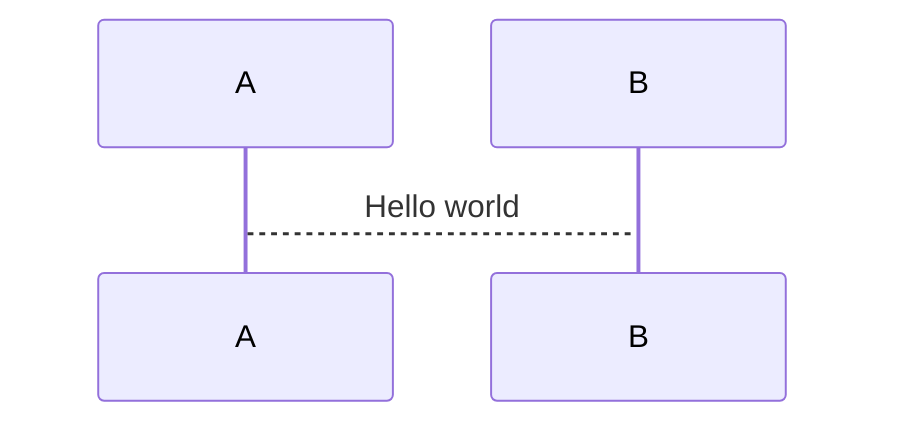

# Test PlantUML

This is the article to test the PlantUML.

```plantuml
@startuml
participant A;
participant B;

A->>B: Hellow world

@enduml
```

Also I want to test the mermaid



This is the endline of the article.
